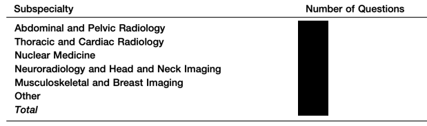
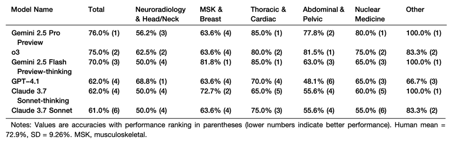
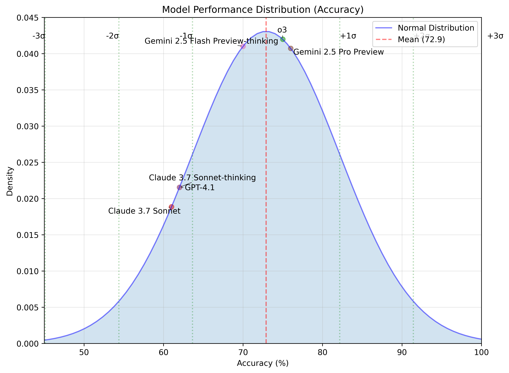
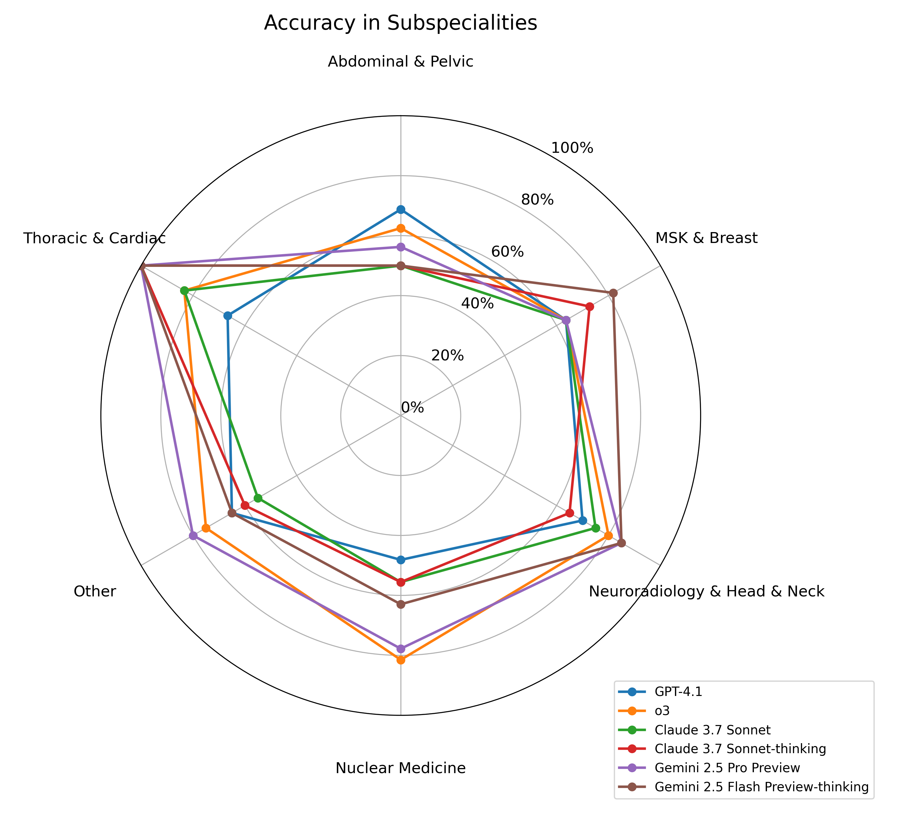

# Materials and Methods

## Ethical Considerations
（今回作成した文章）

## Data Collection
（今回作成した文章）

## Model Selection
（今回作成した文章）

## MLLM Interrogation and Data Processing
（今回作成した文章）

## Statistical Analysis
（今回作成した文章）

\newpage

# Results

（今回作成した文章）

**Table 1. Distribution of questions by subspecialty**



\newpage

**Table 2. Model accuracy (overall and by subspecialty)**



\newpage

**Figure 1. Comparison between student baseline and model accuracy**



\newpage

**Figure 2. Subspecialty-wise model performance (radar chart)**


```